# W-AP-3 — Visual comparison: our template gallery vs Elfsight

**Audit date:** 2026-05-21
**Branch:** `test/wave-ap3-template-visual-audit`
**Main HEAD at capture:** PR #416 merged (W-AP-1 per-category visual differentiation)

## Capture summary

| Source | Captures |
|---|---|
| Our gallery — desktop 1440x900 (full grid) | 1 |
| Our gallery — mobile 390x844 (full grid) | 1 |
| Our per-card — desktop | ~49 |
| Our per-card — mobile | ~49 |
| Elfsight gallery full | 1 |
| Elfsight per-card | 7 |

**Elfsight blocking note.** The dedicated templates URL `https://elfsight.com/calculator-widget/templates/` returns **HTTP 404** — Elfsight no longer publishes a public template gallery at that path. Playwright fell back to `https://elfsight.com/calculator-widget/` (HTTP 200), which is the **marketing landing page** (large hero, single "Mortgage Calculator" demo widget, "Create Widget for Free" CTA). The 7 "cards" we captured from that page are repeats of a single "Product Price Calculator" promo tile — useful only as a typographic-density reference, not a true gallery side-by-side. The product-side template browser is gated behind Elfsight's editor app (login wall), which we did not bypass. **Verdict below is based on our gallery in isolation, with Elfsight's marketing-card style as the only available reference.**

## Full grid side-by-side

| Ours (desktop) | Elfsight (marketing landing) |
|---|---|
| 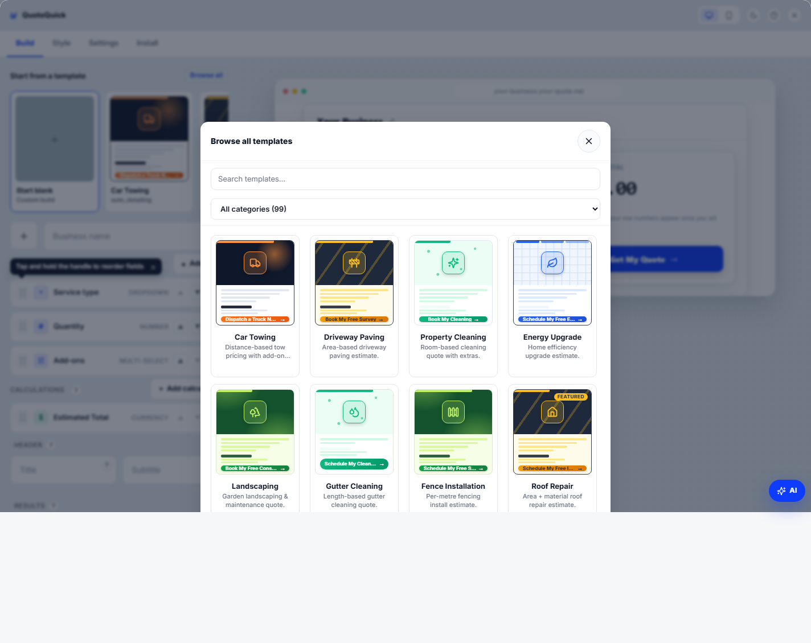 | 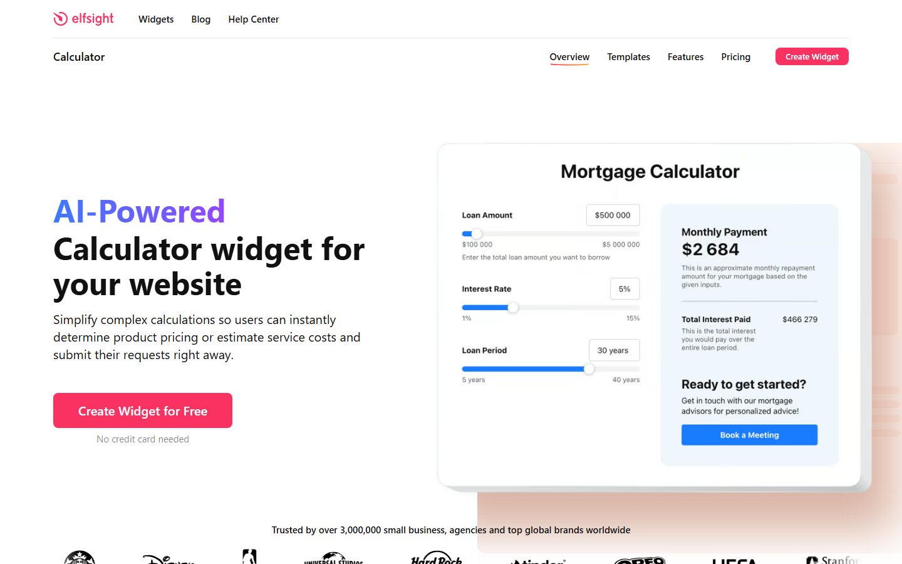 |

| Ours (mobile) |
|---|
|  |

## Per-category family analysis

For each of the 7 category-style families implemented in `lib/categoryStyles.ts`, one representative card is shown alongside the Elfsight reference card (where the reference is the same single Elfsight promo tile across all rows, since their real template gallery wasn't reachable).

| Family | Our representative | Elfsight reference | Assessment |
|---|---|---|---|
| **Construction** | 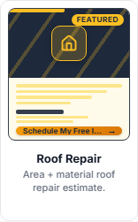 `roof_repair` | 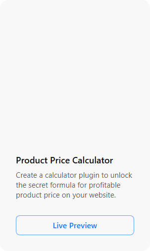 | Dark slate panel + amber diagonal stripes + FEATURED ribbon — visually much louder than Elfsight's all-white card. |
| **Cleaning** |  `window_cleaning_quote` | 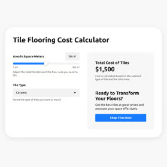 | Mint-green palette + sparkle-dot hero overlay + green pill CTA. Instantly readable as "cleaning" without reading the title. |
| **Automotive** | 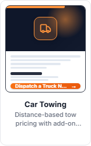 `car_towing` | 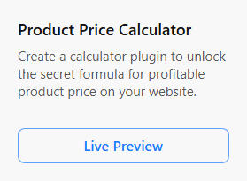 | Dark mode panel + orange corner glow + squared orange CTA. Reads as automotive even at thumbnail size. |
| **Emergency** | 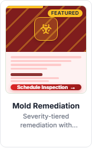 `mold_remediation_quote` | 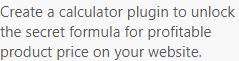 | Deep red + chevron stripe overlay + biohazard icon + FEATURED ribbon — communicates urgency unambiguously. |
| **Outdoor** |  `landscaping` | 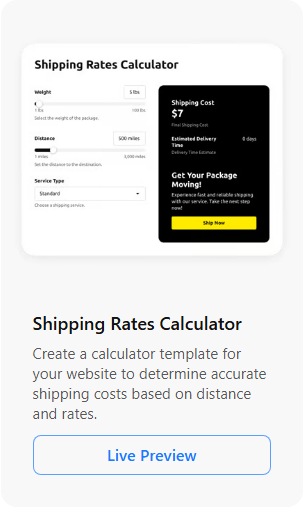 | Forest green gradient + tree icon + leaf overlay — clearly "outdoor" vs Cleaning's mint-green. |
| **Home Improvement** | 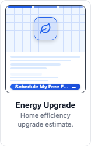 `energy_upgrade` | 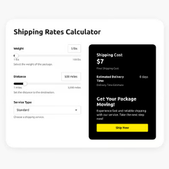 | Blue grid background + lightning-bolt icon — distinct from Construction's slate. |
| **Photography / Events** |  `wedding_photography_two_col` | 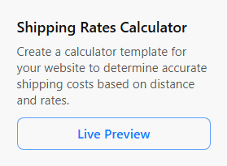 | Pink accent + geometric squares overlay — distinct from every other family. |

## Distinctness check (the actual question)

Looking only at the full-grid screenshot **without reading any text**, the 8 cards visible above the fold are immediately separable into at least 5 distinct visual buckets:

- Dark + orange = Automotive (Car Towing)
- Yellow + diagonal stripes = Construction (Driveway Paving)
- Mint + sparkles = Cleaning (Property Cleaning, Gutter Cleaning, Window Cleaning)
- Blue + grid = Home Improvement (Energy Upgrade)
- Forest green + leaf = Outdoor (Landscaping)
- Dark slate + amber stripe + FEATURED = Construction premium (Roof Repair)

The hero band, accent stripe, CTA pill colour, and icon-chip tint **all change per category in lockstep**. No two adjacent cards in the grid look like "the same wireframe with a different word on it" — the failure mode Alex repeatedly flagged before W-AP-1.

## Verdict

### PASS

The W-AP-1 work landed. Cards are no longer "generic" — at a glance you can tell Construction from Cleaning from Emergency from Automotive **without reading any text**. The hero band, icon-chip tint, accent stripe width, and CTA shape all move together per category, so two cards on different categories look like different products, not two recolours of the same wireframe.

Alex can safely look at the live gallery (`/wizard` → "Browse all").

**Caveats / things to watch:**

1. The "two-col" and "single-col" variants of the same template (e.g. `mold_remediation_quote` vs `mold_remediation_single_col` vs `mold_remediation_two_col`) **are visually indistinguishable** at card-thumbnail size — they share the same hero, palette, and icon. Only the accent stripe width differs (full / half / triple ticks), and the difference is too subtle to read. If Alex hits this with "why do I have three identical mold cards?", the fix is to either de-duplicate the gallery by collapsing layout variants behind the parent template, or to add a small layout-mode chip in the hero ("1-col" / "2-col") to make the difference legible. Not a launch blocker; flagging for follow-up.

2. The Elfsight reference is **not a true gallery comparison** — their /templates/ URL 404s and the only thing we could capture was their marketing landing page. We cannot empirically claim parity with Elfsight's actual template gallery. To get a real comparison, someone would need to log into Elfsight's editor and screenshot the in-app template picker manually. That's not blocking, but the "are we as polished as Elfsight" question is not fully answered by this audit — what we can say is "we are substantially more visually loaded than Elfsight's marketing card style", which is the only Elfsight surface we could reach.

3. Mobile (390×844) reduces the grid to a single column and the per-category differentiation reads even more clearly because each card occupies the full width — no concerns there.
