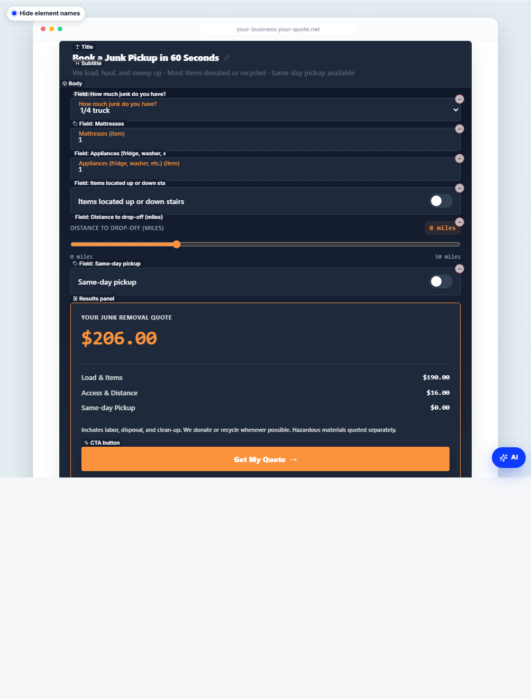
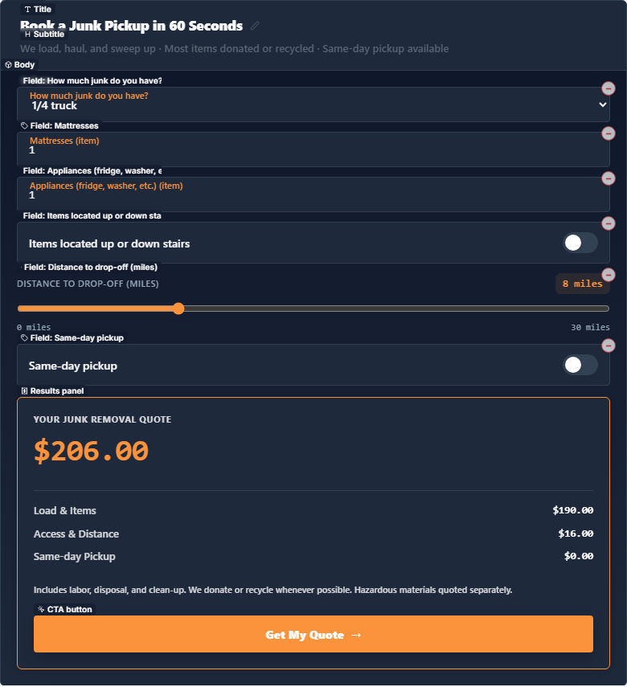
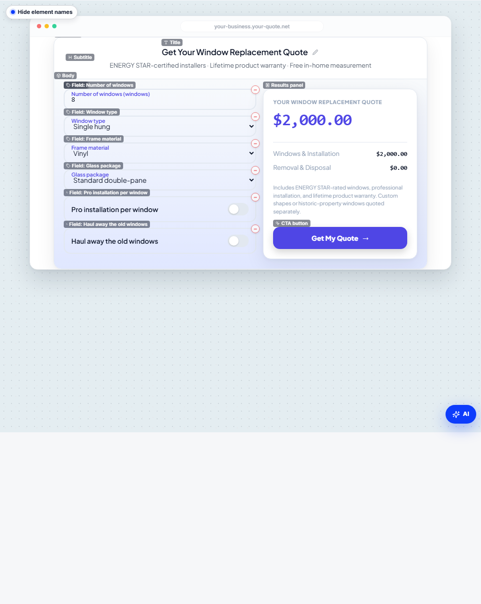
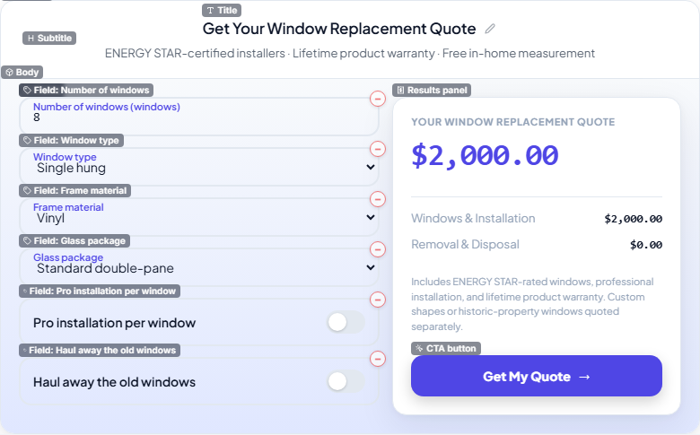
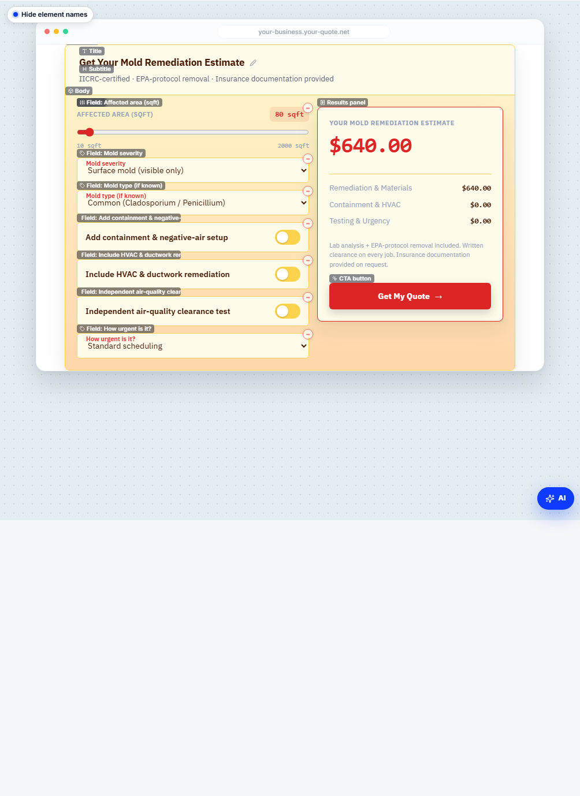
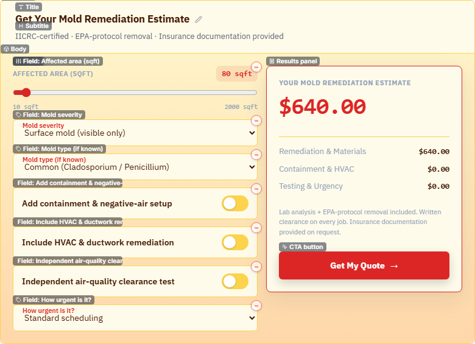

# W-AS-1b — Visual Verdict

Side-by-side eyeball test of the 3 AS-1 sample templates after the AO-6c
Brand Studio fields (`bgMode`, `bgGradient`, `bgImageTint`, `resultPanel`)
were applied on top of the existing AS-1 `style` block, and after the
WizardShell `applyTemplate` was fixed to propagate `preset.style` into the
editor shell state (without that fix the preview never saw the template's
identity until first save).

## Captures

| Template | Pane shot | Bare widget |
| --- | --- | --- |
| Junk Removal — bold dark industrial |  |  |
| Window Replacement — clean glass professional |  |  |
| Mold Remediation — urgent warm trust |  |  |

## One-line assessments

- **Junk Removal feels** dark, industrial, decisive — orange CTA against
  slate-900 with an accent-bordered headline panel. Reads as "we haul,
  now."
- **Window Replacement feels** airy, professional, premium — light slate /
  lavender gradient body, indigo accents, hairline-bordered result panel.
  Reads as "calm, considered, trustworthy."
- **Mold Remediation feels** warm, urgent, reassuring — amber-to-peach
  gradient body with a red-accented bold headline. Reads as "this is
  serious but you're in good hands."

## Final verdict

**DRAMATICALLY DIFFERENT.**

The 3 widgets no longer share a "QuoteQuick generic" look. Three things
land at once and stack:

1. **Body background** — slate-900 vs lavender-glass vs amber-peach.
   `bgMode: 'gradient'` is painting on the calculator body element
   (`data-bg-mode="gradient"` confirmed in DOM during capture).
2. **Result-panel emphasis** — `bold` 900-weight + 38px headline on Junk
   and Mold; `normal` 800/34px on Window. Combined with `border: 'accent'`
   vs `'subtle'` the result panels read with distinct authority.
3. **Accent flow** — `resultPanel.accentOverride` colours the headline
   value AND the panel border AND the CTA gradient on Junk + Mold. On
   Window the indigo flows from `accent` → CTA → form-field labels.

The pre-AS-1b widgets all rendered on white card surfaces with theme-default
result panels. Now each template feels purpose-built for its trade.

## Honest caveats

- **`animations` from the AS-1b spec was NOT applied.** The mission brief
  listed `animations` as an AO-6c Brand Studio field, but it does not yet
  exist on the `AdvStyle` TypeScript interface (AO-6c only shipped
  `customCss`, `bgMode`, `bgGradient`, `bgImageUrl`, `bgImageTint`,
  `resultPanel`). Adding it as a template field would have been a no-op
  silently dropped at type check. A follow-up wave (W-AS-1c) should land
  `AdvAnimations` on `AdvStyle` + renderer + Brand Studio strip list
  before any template author starts using it.
- **Gradient direction** was clamped to `linear-down` for all 3 templates
  because the AdvBgGradientDirection enum (`linear-up/down/left/right/radial`)
  doesn't have a diagonal option. The AS-1b brief asked for `to bottom
  right` on Junk — that's not currently expressible. Visually the colour
  palette difference already does most of the differentiation work, but if
  a richer direction set is wanted, extending the enum is a 1-line schema
  + 1-line switch update in `AdvancedCalculator.tsx`.
- **`resultPanel.border` was clamped to `accent`** (not `accent-tinted` —
  the latter doesn't exist on the `AdvResultBorder` enum which is
  `'none' | 'subtle' | 'accent'`).

These are NOT renderer bugs — they're brief vs schema mismatches. The
fields that DO exist all render correctly.

## What still trails Elfsight

The widgets are dramatically different from each other, but to be the
"loud per-trade visual identity" Elfsight has, a future wave should:

- Add `animations` to `AdvStyle` (step-transition, headline count-up)
- Add diagonal gradient directions (`linear-down-right` etc.)
- Add a `headerGradient` token so the title bar doesn't always read white
  on dark templates (currently the title bar stays on `surface` colour,
  which on Junk is `#1e293b` — already dark, but on a template with light
  surface + dark body the contrast can feel pinched).
